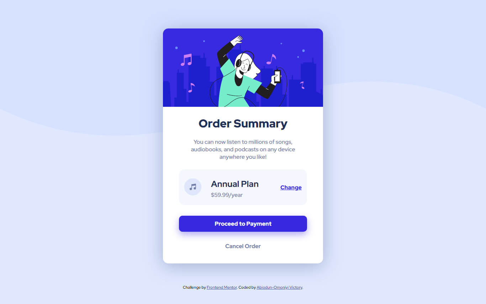
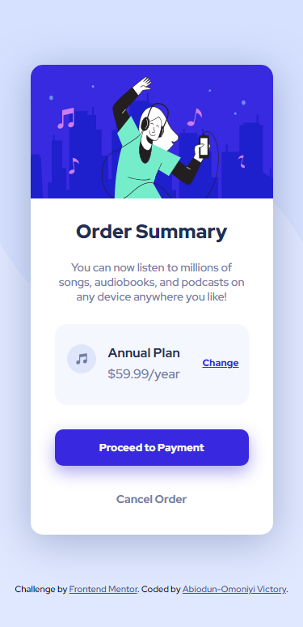

# Frontend Mentor - Order summary card solution

This is a solution to the [Order summary card challenge on Frontend Mentor](https://www.frontendmentor.io/challenges/order-summary-component-QlPmajDUj). Frontend Mentor challenges help you improve your coding skills by building realistic projects. 

## Table of contents

- [Overview](#overview)
  - [The challenge](#the-challenge)
  - [Screenshot](#screenshot)
  - [Links](#links)
- [My process](#my-process)
  - [Built with](#built-with)
  - [What I learned](#what-i-learned)
  - [Continued development](#continued-development)
  - [Useful resources](#useful-resources)
- [Author](#author)


## Overview

### The challenge

Users should be able to:

- See hover states for interactive elements

### Screenshot

 



### Links

- Solution URL: [View my solution URL here](https://github.com/preciousvictory/order-summary-component-main-frontendmentor/)
- Live Site URL: [View my live site URL here](https://preciousvictory.github.io/order-summary-component-main-frontendmentor/)

## My process

### Built with

- Semantic HTML5 markup
- CSS custom properties
- Flexbox

### What I learned

This project has made me learn a lot. These are some of my major learning while working through this project:

HTML
1. I learn how to make the images responsive by the using the srcset and sizes attributes in the image () tag. I specified the image to be used depending of the width of the screen. I aslo added the src attribute for browsers that doesn't support srcset attribute.
```html

```

CSS
1. I learnt how to style a block element with "border-radius" property and how to use in a way that you can specify the radius for each of edges of the box.  I used this property to make only the edges at the top have a border-radius of 15px while the edges at the bottom have no radius.
```css
.box-head-img{
    border-radius: 15px 15px 0 0;
}
```

2. I learnt how to use the " display: flex; ". 
   I added flex-direction property to align the whole contents in the section to be a row. 
   I aslo styled each of the direct descendant with the width property and specified the width of each of them. I used percentage unit for the width value and made sure the total sum of the widths for the direct descendants in the section add up to 100%.
   I also learnt how to add spaces between the elements under the flex group using the gap property.


### Continued development

I want to continue learning more about makong images responsive, how to use srcset and sizes very well in html.

I want to focus more on using CSS flex, flexbox properties.


### Useful resources

- [Example resource 1](https://developer.mozilla.org/en-US/docs/Learn/HTML/Multimedia_and_embedding/Responsive_images) - This helped me to be able to know how to make images responsive.
- [Example resource 2](https://developer.mozilla.org/en-US/docs/Web/CSS/box-shadow) - This is an amazing article which helped me finally understand how to use and style border-radius property. I'd recommend it to anyone still learning this concept.
- [Example resource 3](https://developer.mozilla.org/en-US/docs/Web/CSS/CSS_Flexible_Box_Layout/Basic_Concepts_of_Flexbox) - This really helped me understand flex box. I learnt that i could use the flex property instead of width to specify the with of each element.

## Author

- Website - [Abiodun-Omoniyi Victory](https://preciousvictory.github.io/order-summary-component-main-frontendmentor/)
- Frontend Mentor - [@preciousvictory](https://www.frontendmentor.io/profile/preciousvictory)
- Twitter - [@preciousvicky_](https://www.twitter.com/preciousvicky_)
